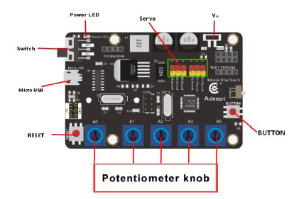
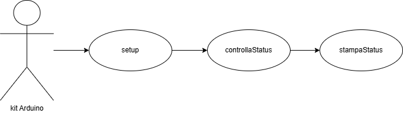
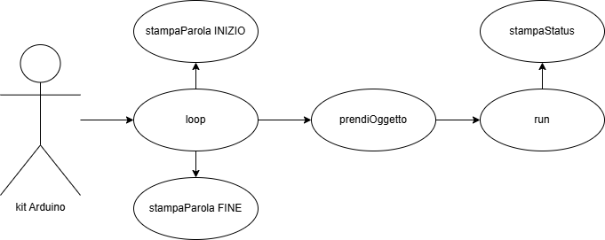
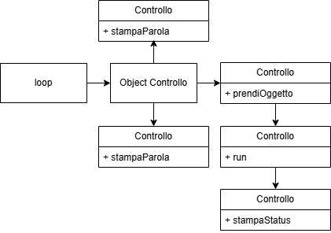

# Funzionamento di un kit Arduino di un braccio robotico

## Introduzione
Il progetto utilizza la tecnologia Arduino con le librerie scritte con il linguaggio di programmazione orientato agli oggetti C++, utilizzato per acquisire le basi di funzionamento un sistema Embedded.

1. Il kit Arduino è composto dalle tecnologie:
2. Una memoria EEPROM;
3. Un display di dimensione di un pollice;
4. Un braccio robotico composto da cinque servo motori elettrici;
5. Sei uscite (Output) che permette di collegare altrettanti servo motori elettrici;
6. Una batteria collegata per kit Arduino per alimentarlo;
7. Una periferica per collegare il kit Arduino con dispositivi esterni, utilizzata per caricare un programma e/o per caricare la batteria.



Fig.1: kit Arduino.

##Obiettivo
Simulare il funzionamento di un sistema Embedded di un braccio robotico, utilizzando un kit Arduino.


Fig. 2: kit Arduino con braccio robotico.

Il programma All.ino scritto con Arduino IDE con il linguaggio di programmazione orientato agli oggetti C++, chiama la classe padre Controllo.h ed esegue le funzioni:
1. **controllaStatus** è una funzione void, verifica il corretto funzionamento dei servo motori elettici dal 1 al 5, chiama la funzione stampaStatus, utilizzata per inviare un feedback di esito positivo o negativo;
2. prendiOggetto è una funzione void, ha come obiettivo di prendere un oggetto di piccole dimensioni come una pallina o una gomma, chiamando la funzione run;
3. **run** è funzione void, che riceve come input il servo motore e l’angolo che deve eseguire la rotazione, e chiama anche StampaStatus per inviare un feedback sullo stato;
4. **stampaParola** è funzione void, stampa a video sul display e sulla console un feedback di inizio e fine di esecuzione del kit Arduino;
5. **StampaStatus** è una funzione void, stampa a video sul display e sulla console un feedback del funzionamento del servo motore elettrico. Quindi se il valore bool value è uguale 1 significa esito positivo, se no è uguale a 0 che significa esito negativo;
6. **svuotaMemoria** è funzione void, controlla ogni cella di memoria EEPROM se è piena, in caso di esito positivo riceve un valore diverso da zero e la sovrascrive impostandolo a 0.

## Casi d’uso
La funzione setup tramite l’oggetto della classe Controllo esegue controllaStatus, e a sua volta esegue StampaStatus.


Fig. 3: Casi d’uso: funzione setup

La funzione loop tramite l’oggetto della classe Controllo esegue:
1. **stampaParola** per stampare a video l’inizio e la fine di esecuzione del programma
2. **prendi Oggetto** esegue il compito di prende un oggetto, chiamando le funzioni run e stampaStatus.



Fig. 4: Casi d’uso: funzione loop

## Conclusione
Il progetto ha dimostrato come sia possibile simulare il funzionamento di un sistema Embedded attraverso l’utilizzo di un kit Arduino, con particolare focus su un braccio robotico controllato da servo motori.

L’approccio adottato, che sfrutta il linguaggio di programmazione orientato agli oggetti C++ attraverso il framework Arduino IDE, ha consentito di implementare diverse funzioni interattive e di monitorare il corretto funzionamento dei servo motori elettrici.


Fig. 5: Diagramma UML della funzione setup

Il progetto ha offerto un’importante opportunità di apprendimento riguardo la gestione di sistemi embedded e la programmazione di dispositivi interattivi, fornendo una base per continuare verso un percorso di miglioramento nel campo della robotica e dell’automazione



Fig. 6: Diagramma UML della funzione loop

```bash
git clone https://github.com/tumminia/arduino